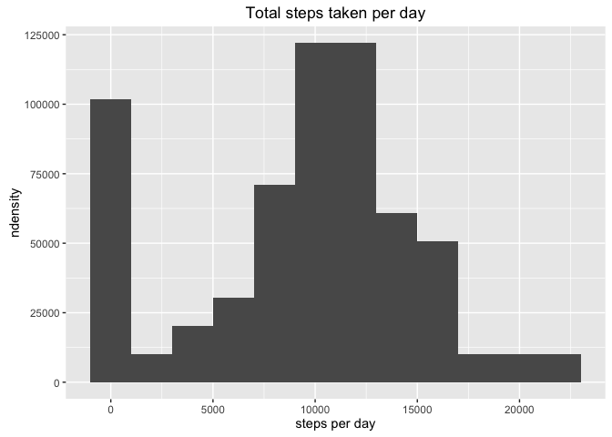
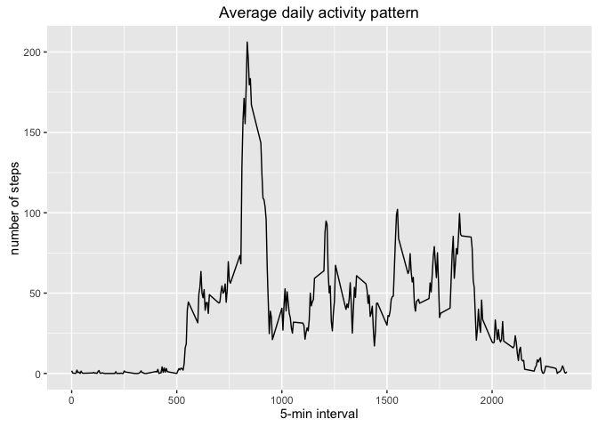
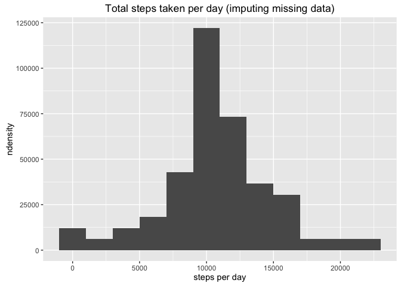
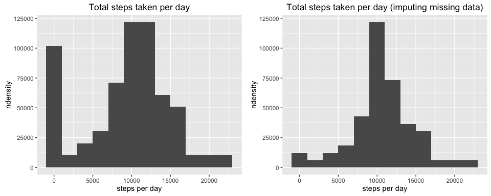
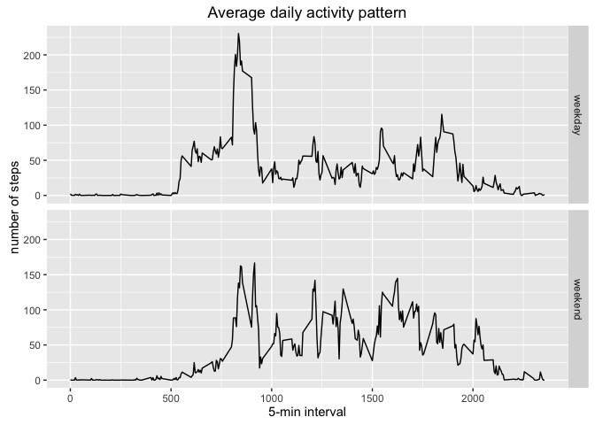

# Reproducible Research: Course Project 1 - Peer Assessment

Data Science Specialization - Johns Hopkins University on Coursera

Course 5 - Reproducible Research - Course Project 1

by Sidclay da Silva

January 2017

## Introduction

This document contains the Course Project 1 - Peer Assessment of the Reproducible Research Course, the 5th of the Data Science Specialization from Johns Hopkins University on Coursera.

The assignment makes use of data from a personal activity monitoring device and it consists in produce a R-Mardown document which should contain a series of questions to be answered by analysing the given data, more details can be found in the README.md.

## Loading and preprocessing the data

For this assignment a ZIP file containg a CSV data set has been given. To be able to access the data set a connection to the ZIP file has been stablished, through it the CSV data set could be loaded.


```r
conActivity <- unz('./activity.zip', 'activity.csv')
datActivity <- read.csv(conActivity, na.strings = 'NA')
```

A quick look at the data set.


```r
str(datActivity)
```

```
## 'data.frame':	17568 obs. of  3 variables:
##  $ steps   : int  NA NA NA NA NA NA NA NA NA NA ...
##  $ date    : Factor w/ 61 levels "2012-10-01","2012-10-02",..: 1 1 1 1 1 1 1 1 1 1 ...
##  $ interval: int  0 5 10 15 20 25 30 35 40 45 ...
```

```r
datObs <- nrow(datActivity)
datVar <- ncol(datActivity)
```

Tha data set contains 3 variables and 17568 observations.

## What is mean total number of steps taken per day?

### Calculate the total number of steps taken per day

Tot calculate the total number of steps taken per day, the *dplyr* package has been used, it allows grouping and afterwards summarising the data set in a quite simple coding.


```r
library(dplyr, warn.conflicts = FALSE)
```

Having the *dplyr* package ready, the data set has been grouped by the variable *date*, and stored it in the same object.


```r
datActivity <- group_by(datActivity, date)
```

After grouping the data set, a summary with the **total** steps per *date* could be created, **NA** values have been removed.


```r
datSum1 <- summarise(datActivity, StepsSum = sum(steps, na.rm = TRUE))

head(datSum1)
```

```
## # A tibble: 6 × 2
##         date StepsSum
##       <fctr>    <int>
## 1 2012-10-01        0
## 2 2012-10-02      126
## 3 2012-10-03    11352
## 4 2012-10-04    12116
## 5 2012-10-05    13294
## 6 2012-10-06    15420
```

### Plot a histogram of the total number of steps taken per day

The *ggplot2* package has been used for the plots, here the histogram of the total steps taken each day, the Y-axis scale has been set to *ndensity*.


```r
library(ggplot2)

graph1 <- ggplot(datSum1, aes(StepsSum, ..ndensity..))
plot1 <- graph1 + geom_histogram(binwidth = 2000) + labs(title = 'Total steps taken per day') + labs(x = 'steps per day')

print(plot1)
```

<!-- -->

### Calculate the mean and median of the total number of steps taken per day

The **mean** and **median** of the total steps taken per day have also been calculated via summary, **NA** values have been removed.


```r
datMean1 <- summarise(datSum1, Mean = mean(StepsSum, na.rm = TRUE), Median = median(StepsSum, na.rm = TRUE))

datMean1
```

```
## # A tibble: 1 × 2
##      Mean Median
##     <dbl>  <int>
## 1 9354.23  10395
```

## What is the average daily activity pattern?

### Calculate the average number of steps for each interval across all days

To calculate the daily activity pattern, the data set has been grouped by the variable *interval*, and stored in the same object.


```r
datActivity <- group_by(datActivity, interval)
```

After grouping the data set, a new summary has been created taking the **mean** of the variable *steps* per interval considering all days, **NA** values have been removed.


```r
datInt1 <- summarise(datActivity, StepsAverage = mean(steps, na.rm = TRUE))

head(datInt1)
```

```
## # A tibble: 6 × 2
##   interval StepsAverage
##      <int>        <dbl>
## 1        0    1.7169811
## 2        5    0.3396226
## 3       10    0.1320755
## 4       15    0.1509434
## 5       20    0.0754717
## 6       25    2.0943396
```

### Plot a time series of the 5-min interval and the average number os steps taken
Time series plot of the average number of steps taken.


```r
graph2 <- ggplot(datInt1, aes(interval, StepsAverage))
plot2 <- graph2 + geom_line() + labs(title = 'Average daily activity pattern') + labs(x = '5-min interval') + labs(y = 'number of steps')

print(plot2)
```

<!-- -->

The *5-min interval* which contains the maximum number of steps, on average across all the days, has been found using the *filter* function (*dplyr* package) in combination with the *max* function.


```r
datMax <- filter(datInt1, StepsAverage == max(StepsAverage))

datMax
```

```
## # A tibble: 1 × 2
##   interval StepsAverage
##      <int>        <dbl>
## 1      835     206.1698
```

The *5-min interval* **835** contains the maximum average of steps, **206.1698113**.

## Imputing missing values

### Calculate the number of missing values in the data set

To calculate the missing values in the data set, a loop has been set across all the variables counting the missing rows.


```r
for (i in 1:ncol(datActivity)){
      print(c(names(datActivity[,i]), nrow(datActivity[is.na(datActivity[,i]),])))
}
```

```
## [1] "steps" "2304" 
## [1] "date" "0"   
## [1] "interval" "0"
```

There are missing data (**NA**) only in the variable *steps*.

### Devise a strategy for filling in all of the missing values in the dataset

The strategy to fill in all the missing value has consisted on taking the mean of the respective *5-min interval* and using it to overwrite the *NA* entries.

Inicially the original data set has been merged with the summary on average steps taken by interval and stored into a new data set. As the merged data set has its own sorting, it has been re-ordered by date and interval with function *arrange* (*dplyr* package).


```r
datActivityNew <- merge(datActivity, datInt1)
datActivityNew <- arrange(datActivityNew, date, interval)

head(datActivityNew)
```

```
##   interval steps       date StepsAverage
## 1        0    NA 2012-10-01    1.7169811
## 2        5    NA 2012-10-01    0.3396226
## 3       10    NA 2012-10-01    0.1320755
## 4       15    NA 2012-10-01    0.1509434
## 5       20    NA 2012-10-01    0.0754717
## 6       25    NA 2012-10-01    2.0943396
```

After that, the observations containing missing values have been identified and stored in a logical vector with function *complete.cases*, observations with missing data are identified as logical *FALSE*.


```r
complete <- complete.cases(datActivityNew)
```

Then the missing values have been replaced by the average steps taken in each *5-min interval* for the observations identified as *FALSE* in the logical vector. Finally the variable *StepsAverage* has been removed from the data set with the function *select* (*dplyr* package).


```r
datActivityNew[!complete,"steps"] <- datActivityNew[!complete,"StepsAverage"]
datActivityNew <- select(datActivityNew, steps, date, interval)
```

Recalculating the missing values for the variable *steps* in the new data set, to confirm none of them are left.


```r
nrow(datActivityNew[is.na(datActivityNew$steps),])
```

```
## [1] 0
```

### Plot a second histogram of the total number of steps taken per day

After imputing missing data a second version of the histogram total number of steps taken each day could be created.

The same procedure has been taken, the new data set has been grouped by the variable *date*, and a summary with the **total** steps per *date* has been created.


```r
datActivityNew <- group_by(datActivityNew, date)
datSum2 <- summarise(datActivityNew, StepsSum = sum(steps, na.rm = TRUE))
```


```r
graph3 <- ggplot(datSum2, aes(StepsSum, ..ndensity..))
plot3 <- graph3 + geom_histogram(binwidth = 2000) + labs(title = 'Total steps taken per day (imputing missing data)') + labs(x = 'steps per day')

print(plot3)
```

<!-- -->

### Calculate the mean and median of the total number of steps taken per day

The **mean** and **median** of the total steps taken per day have also been recalculated after imputing missing data.


```r
datMean2 <- summarise(datSum2, Mean=mean(StepsSum, na.rm = TRUE), Median=median(StepsSum, na.rm = TRUE))

datMean2
```

```
## # A tibble: 1 × 2
##       Mean   Median
##      <dbl>    <dbl>
## 1 10766.19 10766.19
```

### Comparison between the original data and after imputing missing data

To better analyse the results, the plots in one view. The function *grid.arrange* from *gridExtra* package has been used to allow multiplots within *ggplot2*.


```r
library(gridExtra, warn.conflicts = FALSE)

grid.arrange(plot1, plot3, ncol=2)
```

<!-- -->

The histogram after imputing missing data shows that the densitiy has become higher in the area of the **median**, with noticeable reduction of density in the area of 0. 

The mean and median of the total number of steps taken per day have increased, achieving both of them the same value, what is coerent with the histogram.


```r
c(datMean1,datMean2)
```

```
## $Mean
## [1] 9354.23
## 
## $Median
## [1] 10395
## 
## $Mean
## [1] 10766.19
## 
## $Median
## [1] 10766.19
```

## Are there differences in activity patterns between weekdays and weekends?

### Indicating whether a *date* is a **weekday** or **weekend**

A new factor variable *WeekStatus* has been created in the new data set to indicate whether the *date* is a **weekday** or **weekend**. This task has been accomplished using the *mutate* function (*dplyr* package) in combination with the *factor* and *weekdays* functions.


```r
datActivityNew <- datActivityNew %>% mutate(WeekStatus = factor(weekdays(as.Date(date), abbreviate = TRUE) %in% c('Sat','Sun'), levels=c(FALSE,TRUE), labels=c('weekday','weekend')))

head(datActivityNew)
```

```
## Source: local data frame [6 x 4]
## Groups: date [1]
## 
##       steps       date interval WeekStatus
##       <dbl>     <fctr>    <int>     <fctr>
## 1 1.7169811 2012-10-01        0    weekday
## 2 0.3396226 2012-10-01        5    weekday
## 3 0.1320755 2012-10-01       10    weekday
## 4 0.1509434 2012-10-01       15    weekday
## 5 0.0754717 2012-10-01       20    weekday
## 6 2.0943396 2012-10-01       25    weekday
```

### Calculate the daily activity pattern per *WeekStatus*

To calculate the daily activity pattern per *WeekStatus*, the data set has been grouped by the variables *WeekStatus* and *interval*, and stored in the same object.


```r
datActivityNew <- group_by(datActivityNew, WeekStatus, interval)
```

After grouping the data set, a new summary has been created taking the **mean** of the variable *steps* per *WeekStatus* and *interval*.


```r
datInt2 <- summarise(datActivityNew, StepsAverage = mean(steps, na.rm = TRUE))

datInt2
```

```
## Source: local data frame [576 x 3]
## Groups: WeekStatus [?]
## 
##    WeekStatus interval StepsAverage
##        <fctr>    <int>        <dbl>
## 1     weekday        0   2.25115304
## 2     weekday        5   0.44528302
## 3     weekday       10   0.17316562
## 4     weekday       15   0.19790356
## 5     weekday       20   0.09895178
## 6     weekday       25   1.59035639
## 7     weekday       30   0.69266247
## 8     weekday       35   1.13794549
## 9     weekday       40   0.00000000
## 10    weekday       45   1.79622642
## # ... with 566 more rows
```

### Plot a time series of the 5-min interval per *WeekStatus*

The time series plot of the average number of steps taken per *WeekStatus* shows that, on average, the subject is more active in earlier periods during weekdays than weekends, on the other hand, it is more active during later periods during weekends.


```r
graph4 <- ggplot(datInt2, aes(interval, StepsAverage))
plot4 <- graph4 + geom_line() + facet_grid(WeekStatus ~ .) + labs(title = 'Average daily activity pattern') + labs(x = '5-min interval') + labs(y = 'number of steps')

print(plot4)
```

<!-- -->
